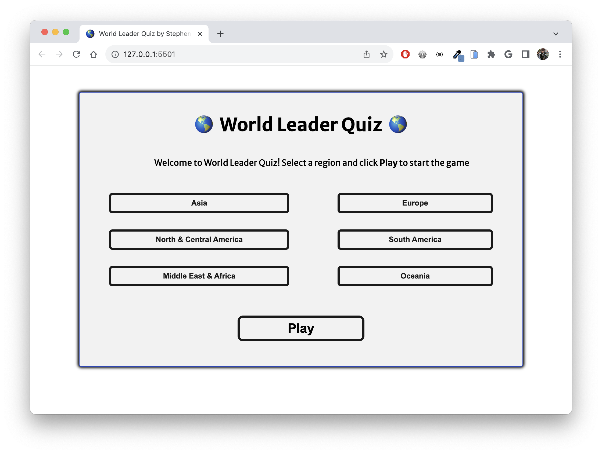

# World Leader Quiz

## Project Description 

"World Leaders" is an online quiz game built to help you memorize the names of world leaders and the countries where they lead. You will be able to pick a global region like Asia or Europe.  This game will initially have one region - Europe. During gameplay, you'll see a series of 20 cards (presented individually) representing countries in that region. Below the country title and the official flag, you will see a multiple-choice question with 4 options: the name of the correct world leader and 3 other leaders in the region. After you make a selection, you'll see if your choice was correct or incorrect (if incorrect, you'll also see the correct option).  Users win if they are above 60% correct for the region.

The game is not timed; you can take as long as you want to choose your answers.  

This game is built in HTML, CSS, and Javascript.

## Play Now

Deployed Website: https://world-leader-quiz.netlify.app/

GitHub Repo: https://github.com/Stephen-c-Kelly/WorldLeaderQuiz/blob/main/README.md

## Wire Frames

**Initial Home View**

View of homescreen where users can review instructions, select one option among the available regions, and press play.

https://imgur.com/a/RBaouL2 

**Gameplay - Card Detail View**

Country Card centered in the window containing the following:

- Name of country
- 4 choices in a randomized order:
-- 1 correct option
-- 3 incorrect options (names taken from the list of leader's names in the region)
- Next button (inactive until the user makes a selection)

Upon making a selection, users will see the correct and incorrect options highlighted in green and red. Users will be able to click the next button to see another card in the stack

Wireframe 1
https://imgur.com/a/J1RKF0k

Wireframe 2
https://imgur.com/a/i0nBxEX

**End of Game Detail View**

After all cards have been played, the end-of-game view is triggered.  

- Number and % of correct answers 
- You win / You lose message.  Above 60% is counted as a win
- Play Again button
  
https://imgur.com/a/vM4LRJ1

Find all Wireframes here - https://excalidraw.com/#json=MXWTkjL3lbrfMbya_BzEa,S0ZUIiUWM70UJSmmToyYNg 

#### How to Play



#### MVP Goals

As a player...
- I want to be able to select a region of the world to start the game.
- I want to see a card with the name of a country and 4 options for the name of the country's leader.
- I want to be able to reset the game if I select the wrong region.
- I want to be able to make a selection and see if my choice was correct.
- I want to see the correct choice even if my choice was incorrect.
- I want to see how well I did at the end of the game.
- I want to reset the game and select another region to play again.
- I want the UI to be engaging and out of the way so that I enjoy the experience of playing the game.

#### Stretch Goals

- *Gameplay Card Detail View* - add a counter with the number of cards completed/remaining.
- I'd like to implement animation to smooth the transition between cards.  
- I'd like to implement animation to make the correct/incorrect options more interesting/delightful.
- I'd like to leverage an API or a Google Sheet to more easily update the names of the leaders after elections.
- I'd like to include vector outlines of each country.
- I'd like to integrate a 'countdown' option with a  countdown clock.
- I'd like to integrate a 'hard' option to make the 3 incorrect choices more difficult (maybe they can be the names of the country's former leader, or they can be other notable figures from that country).
- I'd like to include links to YouTube videos showing how to pronounce each leader's name.


#### Pseudo Code

```
// Step 0 - Data Architecture

- Share format with chatGPT and ask to generate countries with the following fields
-- Country Name
-- Flag emoji
-- Region
-- World Leader
-- Wrong Choice 1 (random leader from the same region)
-- Wrong Choice 2 (random leader from the same region)
-- Wrong Choice 3 (random leader from the same region)

The following fields will be added but left blank for MVP
-- Annual GDP (unused during MVP)
-- Assumed Office Date (unused during MVP)
-- Country Image (vector image of outline)
-- YouTube link to how to purchase name (no idea how to set this up, but maybe I can use Bard to search YouTube)

// Step 1 - Define the required variables used to track the state of the game

- Variable named 'board' to keep track of the state of the board (Menu view, card detail, end-of-game detail)
- Variable named 'counter' to track the final number of correct answers
- Variable named 'results' to track win/lose. 
- Variable named 'country' which will look in the data to build a list of countries based on region used in gameplay

// Step 2 - Cached element references
- Variable named 'activeRegion' to keep track of the selected region
- Variable named 'activeCountry' to keep track of the country on display.
- Variable named 'activeChoices' to display choices for an active country.
- Variable named 'correctChoice' to track the correct choice for the active country

// Step 3 - Initialize the game state and render
- init, which will initialize the game
-- set board to menu
-- set winner to false
-- set counter to 0
-- set results to null
-- trigger render function

// Step 4 - The state of the menu should be rendered to the user
-- create 'render' function (will be defined later)
-- create 'updateMenu' which will display the intro copy and menu, and Play Game button
**** is this the same as the "set board to menu" step in the init function? ****
-- create a click event that listens for the user's selection of region and stores the choice
-- create a click event called play that calls the following functions when the Play Game button is triggered:
----activeStack
----setChoices
----display card detail view

-- create a function called render
----updateMenu
----displayCardDetail
----resultsDisplay
**** SK Note - I'm unclear how we prevent this from calling all the game states at once. **** 

-- create a function called activeStack:
---- Build an array of country cards based on the available data, ordered randomly
---- sets the first card to activeCountry

-- create a function called setChoices:
---- build array with correct choice and incorrect choices in a randomized order 
---- build incorrect choices by selecting 3 random world leaders in the same region

-- create a function called display card detail view
----show active country
----display each item in the setChoices array in a button
----show next button (inactive)
----show close button

-- create a function called 'close'
----set an event listener so that the user is taken back to the main menu on click.
----render function

--create a function called checkCorrect
----set an event listener function so that the buttons displaying each choice will change the background color (green for correct, red for incorrect) once the user makes a selection
----once button is selected, change the state of all choice buttons to inactive so the user can't make another selection
----Next button is set to active state and is now clickable

create a function called nextCard
-- set an event listener that triggers the following actions when the Next button is clicked:
----set the next country card in activeStack to activeCountry
----render function

create a function called seeResults
-- if activeStack has no more items, update the Next button copy to say "See Results"
-- once See Results button is clicked, call render

create a function called resultsDisplay 
-- if % of correct answers is above 60%, set winner to true
-- display message "You win" or "You Lose"
-- display number and % of correcct answers.
-- display Play Again button.

create a playAgain function
-- click event handler so that, when user clicks Play again button, the function close is triggered.
-- call init


#### Timeline - Daily Accountability


| Thursday  |   | Create proposal                                                    
| Friday    |   | Present Proposal, revise pseudocode, create wireframes             
| Saturday  |   | Create HTML and style with CSS, create Data Structure              
| Sunday    |   | Complete styling with CSS,                                         
| Monday    |   | Create variables and event listeners in Javascript. Create Menu 
| Tuesday   |   | Create Card Detail View                                            
| Wednesday |   | Finish Detail View, Create Results View                            
| Thursday  |   | Stretch Goals                                                      
| Friday    |   | Presentation       


#### Resources

- https://mledoze.github.io/countries/
- https://restcountries.com/#rest-countries 