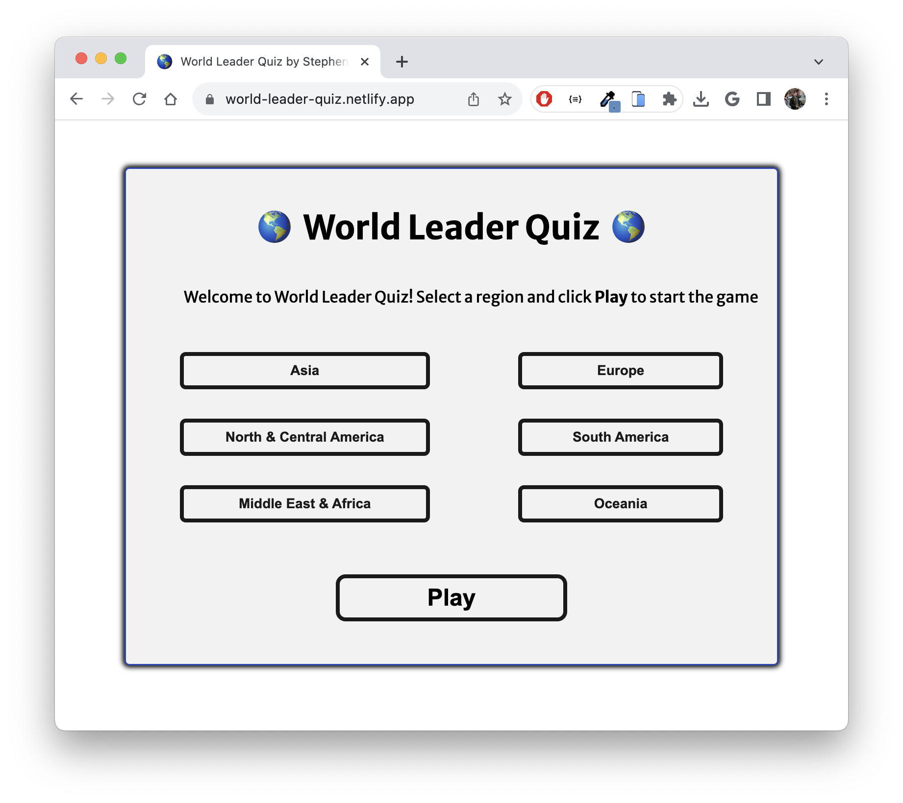
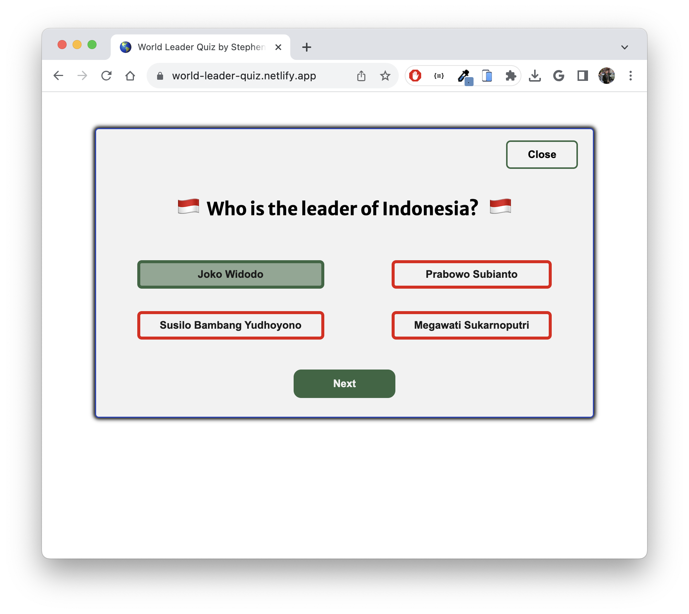
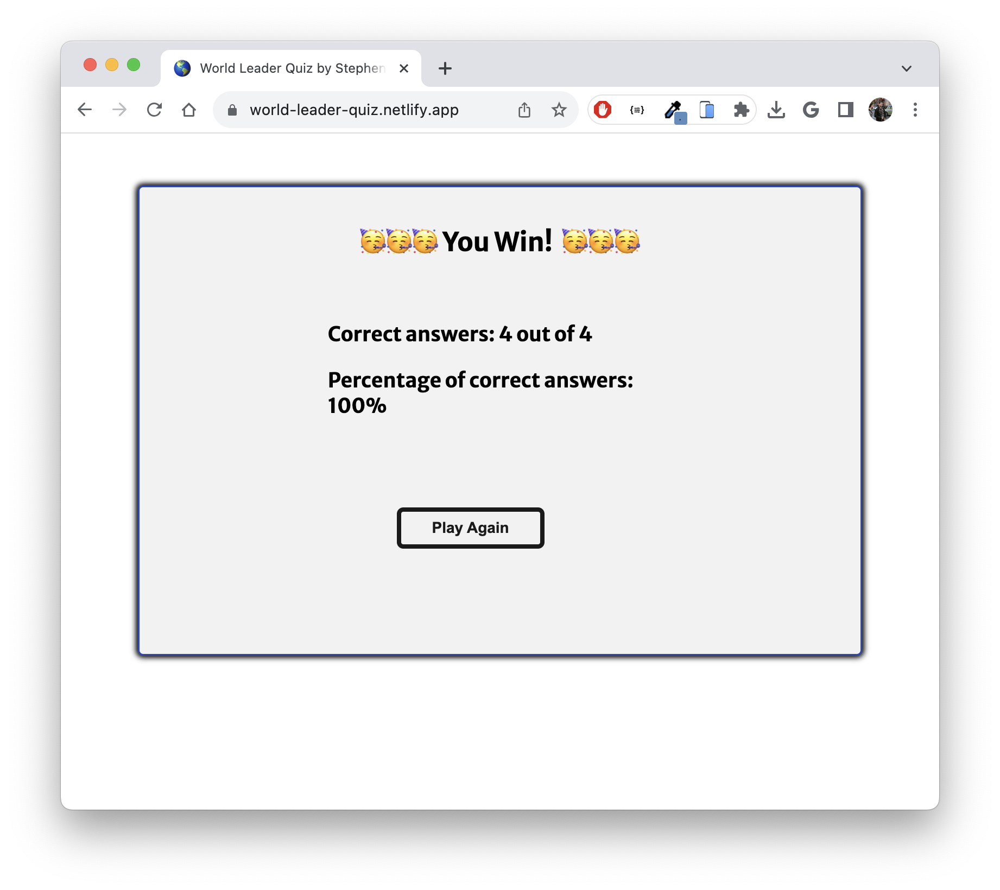

# World Leader Quiz

## Project Description 

"World Leaders Quiz" is an online quiz game built to help you memorize the names of world leaders and the countries they lead. During gameplay, you'll select a region, and then see a series of 6 cards (presented individually) representing countries in that region. Below the country title and the official flag, you will see a multiple-choice question with 4 options: the name of the correct world leader and 3 other leaders in the region. After you make a selection, you'll see if your choice was correct or incorrect (if incorrect, you'll also see the correct option).  Users win if they are above 60% correct for the region.

The game is not timed; you can take as long as you want to choose your answers.  

This game is built in HTML, CSS, and Javascript.

## Data Architecture
I used Chat GPT 3.5 to develop a data structure and gather a dataset of 85 countries.  Through testing, we uncovered multiple instances of LLM hallucinations and/or outdated information.  To resolve these data errors we cross-referenced our dataset with Bard Ai to identify inaccurate results.  However, given LLM's potential for errors, *this data should not be considered 100% accurate and mistakes may linger.* I apologize for any errors or omissions.

## Play Now

Deployed Website: https://world-leader-quiz.netlify.app/

GitHub Repo: https://github.com/Stephen-c-Kelly/WorldLeaderQuiz/blob/main/README.md

#### How to Play
Select a Region from the Main Menu

Answer questions, and click Next.  You can also close the game and return to the main menu.

View Results, and press play again to return to the Main Menu.

#### MVP Goals

As a player...
- I want to be able to select a region of the world to start the game.
- I want to see a card with the name of a country and 4 options for the name of the country's leader.
- I want to be able to reset the game if I select the wrong region.
- I want to be able to make a selection and see if my choice was correct.
- I want to see the correct choice even if my choice was incorrect.
- I want to see how well I did at the end of the game.
- I want to reset the game and select another region to play again.
- I want the UI to be engaging and out of the way so that I enjoy the experience of playing the game.

#### Stretch Goals

- *Gameplay Card Detail View* - add a counter with the number of cards completed/remaining.
- I'd like to implement animation to smooth the transition between cards.  
- I'd like to implement animation to make the correct/incorrect options more interesting/delightful.
- I'd like to leverage an API or a Google Sheet to more easily update the names of the leaders after elections.
- I'd like to include vector outlines of each country.
- I'd like to integrate a 'countdown' option with a  countdown clock.
- I'd like to integrate a 'hard' option to make the 3 incorrect choices more difficult (maybe they can be the names of the country's former leader, or they can be other notable figures from that country).
- I'd like to include links to YouTube videos showing how to pronounce each leader's name.

#### Timeline - Daily Accountability

| Thursday  |   | Create proposal                                                    
| Friday    |   | Present Proposal, develop pseudocode, create wireframes, stub out JS with pseudocode            
| Saturday  |   | Create temporary data structure, Create HTML, create JS variables and event listeners
| Sunday    |   | Create Menu and Card Detail state                                         
| Monday    |   | Create results state, build wrong/correct and results logic
| Tuesday   |   | Generate Data, Create CSS, revise logic with 6 regions and data                                         
| Wednesday |   | CSS Updates, JS improvements                           
| Thursday  |   | Stretch Goals, CSS updates                                                     
| Friday    |   | Presentation      

#### Resources

- https://mledoze.github.io/countries/
- https://restcountries.com/#rest-countries 
- https://chat.openai.com/
- https://bard.google.com/ 
- JS/HTML/CSS Tutorial: https://www.youtube.com/watch?app=desktop&v=riDzcEQbX6k&ab_channel=WebDevSimplified
